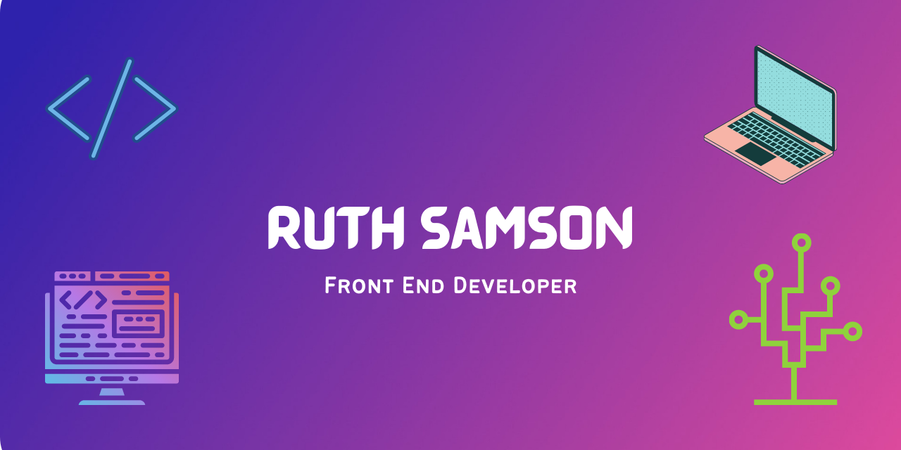

# 👋🏽 Hello, I'm Ruth!

I am a front end developer that loves to make visually pleasing and accessible websites and apps. I am always striving to expand my knowledge and becoming a valuable asset to any team I'm working with. 

---

# 🔨  My Tech Stack: 

---
 
# 📫 Where to Reach Me: 

---

**⚡ Fun facts:** 

🎾 🏹 - My favorite sports are tennis and archery. 
 
🎹 🎸 - I play the piano & electric guitar.

🎬 📺 - I love movies & tv shows. My favorite genres are sci-fi & apocalyptic.   

